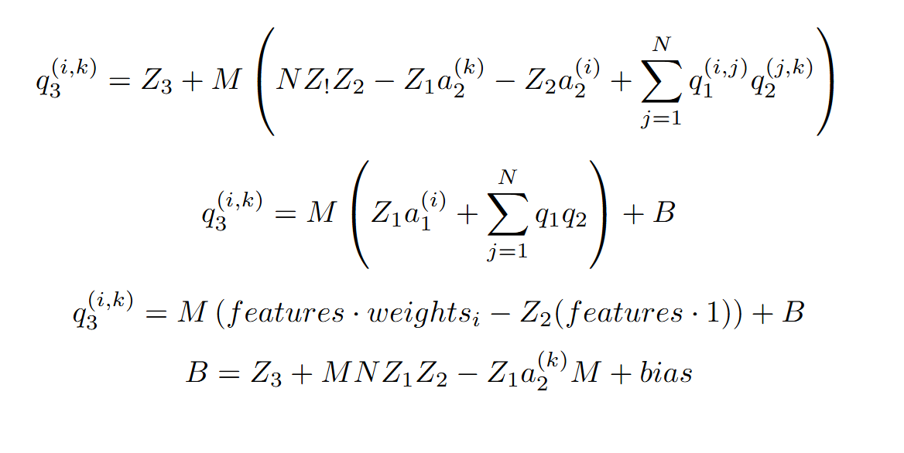
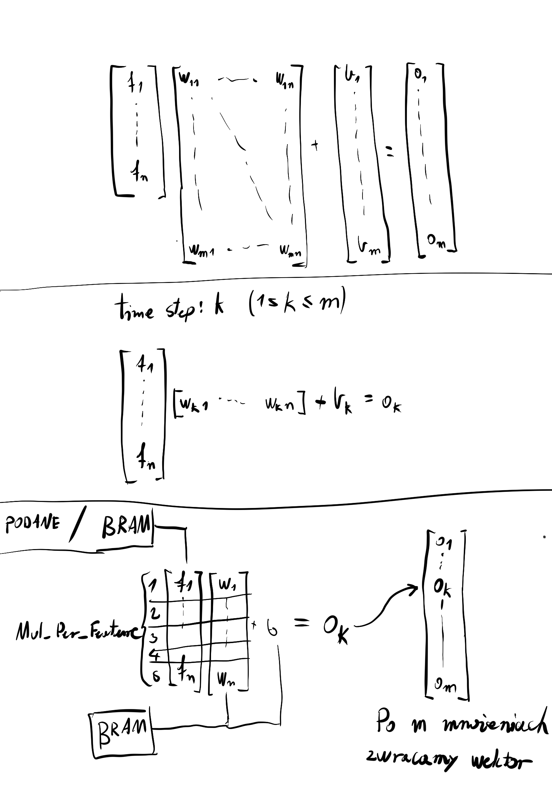

# LinearFPGA
Implementacja metody mnożenia macieży opisanej w: 

[Quantization and Training of Neural Networks for Efficient
Integer-Arithmetic-Only Inference](https://arxiv.org/abs/1712.05877)

w języku SystemVerilog dla płytek FPGA.

# Architektura
## Wzory
używamy przekształconego wzoru do wyliczania outputów z papieru gdzie a2, z1, z2, n, z3, m jest znane w czasie kompilacji więc można to zapisać jako: 

## Funcjonalność
implementujemy więcej niż tylko to co w papierze, dostosowywujemy to też dla układów FPGA.
Nasz projekt implementuje również:

- PRECISION - można dobierać precyzje mnożarki do kwantyzacji (default: 8 bitów)
- BIAS_PRECISION - można dobierać precyzje super biasu do tego jaka nam jest potrzebna (default: 32 bity)
- NUM_FEATURES - możemy obliczać wyniki dla kilku featuresów na raz
- N - rozmiar wektora wejścia
- M - rozmiar wektora wyjścia
- M_MUL - Stała we wzorze nazwana M
- MUL_PER_FEATURE - ilość mnożarek liniowych na jeden feature
- TEMP (Nazwa tymczasowa) - nie pamiętam, oops

# Jak używać

Polecam poczekać aż ktoś zrobi ostatni punkt todo. Jak narazie:

cd SW

python quantization_program_model.py

// to zasymuluje w pythonie poprawny program. Zapisze wszystkie wagi, featuresy i wyniki do plików .mem

i odpalić symulacje w vivado, na test benchu która zapisze output programu na podstawie featuresów i wag z modelu programowego

# todo
- nie wiem czemu w kodzie jest tylko zero point wag podany, jak znajde więcej to rozszeze tą liste.
- Pamiętam że był błąd z M_Mul które działało tylko dla pierwszego featuresa, albo przykładu nwm
- 2 BRAM'y gdzie używamy jednego a drugi jest napełniany nowymi wagami z ramu.
- Odpalić na płytce
- skrypt który zamieni normalnie zapisany zkwantyzowany model na .mem, a nie tylko losowo wygenerowane dane z modelu programowego

